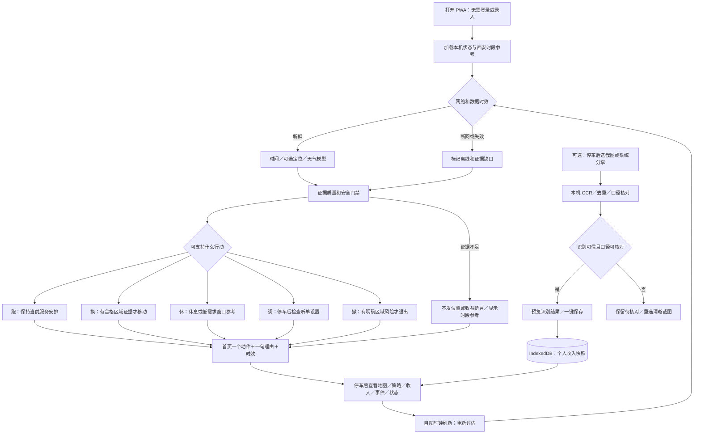
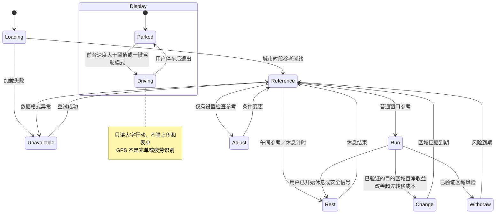
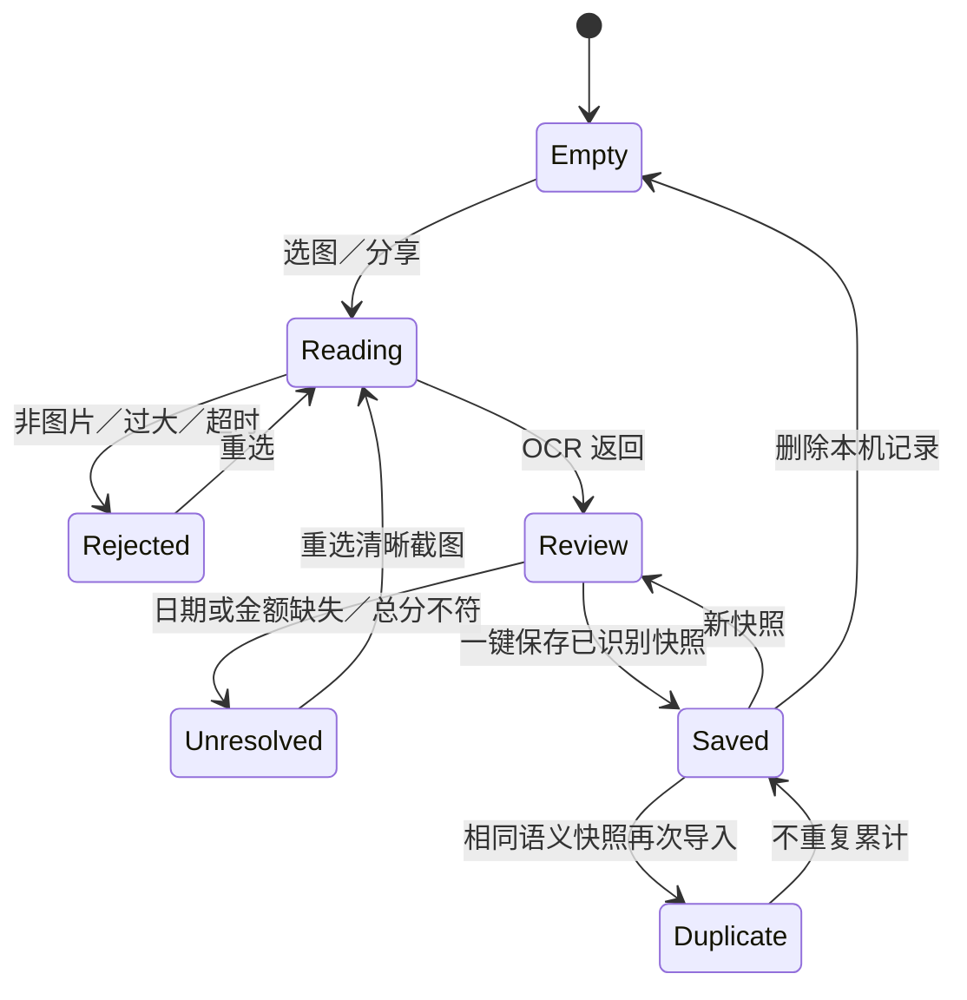
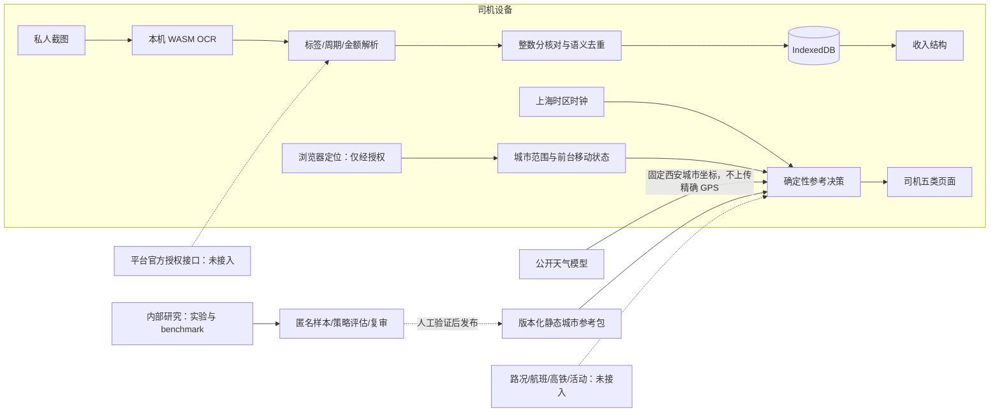
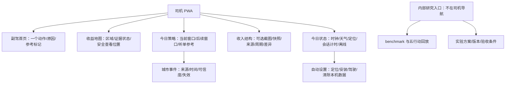
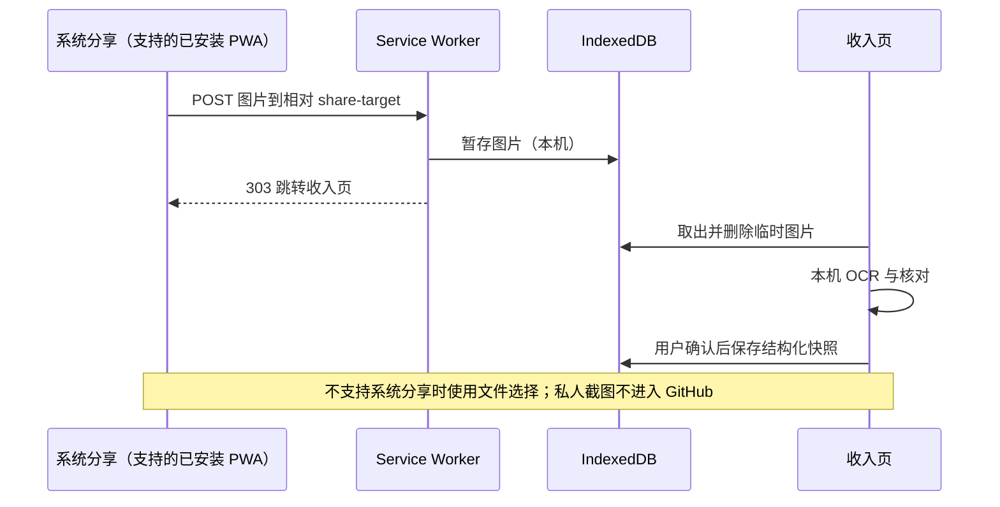
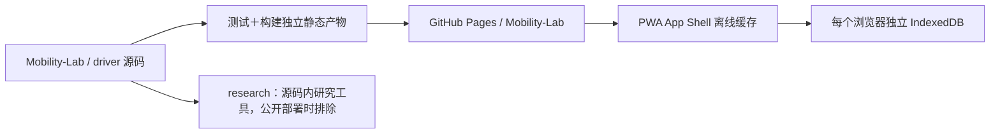

# 司机收益副驾：产品全链路
版本 0.1，2026年09月08日。图中虚线表示待接入能力，不表示已经运行。

## 用户旅程与决策链

## 行动状态机与驾驶保护

## 收入导入状态机

## 数据流与隐私边界

## 页面信息架构

## 部署图与分享时序

## 关键不变量
金额单位为整数分；缺失不是0；原标签不被统一覆盖。日收入、日流水、月流水为不同快照，不相加。总分核对通过不等于平台结算正确。没有成本和时长不能计算净收入或净时薪。个人原图与识别全文不进入公开产物。示例／历史／实时证据不能混用。离线不复用过期行动。
